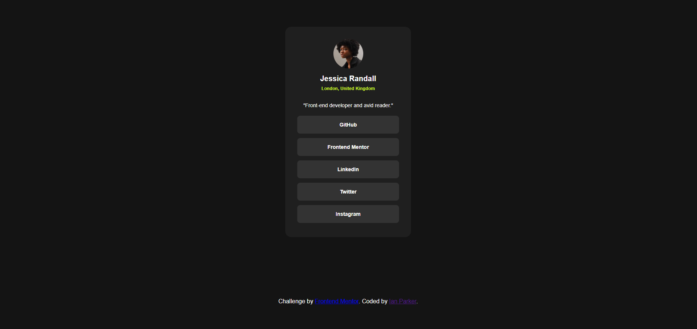

# Frontend Mentor - Social links profile solution

This is a solution to the [Social links profile challenge on Frontend Mentor](https://www.frontendmentor.io/challenges/social-links-profile-UG32l9m6dQ). Frontend Mentor challenges help you improve your coding skills by building realistic projects.

## Table of contents

- [Overview](#overview)
  - [The challenge](#the-challenge)
  - [Screenshot](#screenshot)
  - [Links](#links)
- [My process](#my-process)
  - [Built with](#built-with)
  - [Continued development](#continued-development)
- [Author](#author)

**Note: Delete this note and update the table of contents based on what sections you keep.**

## Overview

### The challenge

Users should be able to:

- See hover and focus states for all interactive elements on the page

### Screenshot

### Links

- Solution URL: [Github](https://github.com/i-prkr/social-links-profile)

### Built with

- Semantic HTML5 markup
- CSS variables
- Flexbox
- Transitions

### Continued development

On finishing this project I am eager to continue becoming more fluent in CSS and using different CSS techniques for more concise code.

## Author

- Website - [Ian Parker](https://github.com/i-prkr)
- Frontend Mentor - [@i-prkr](https://www.frontendmentor.io/profile/i-prkr)
